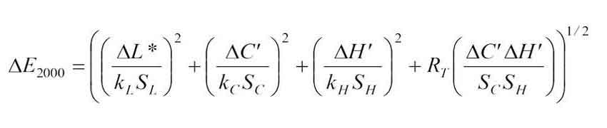

# CIEDE2000 Color-Difference

This software is not affiliated with the CIE (International Commission on Illumination), has not been validated by it, and is released into the **public domain**. It is provided "as is" without any warranty.

## Status

Ready to be deployed in **production** environments.

## Version

This document describes the **CIE ΔE00** functions v1.0.0, released on March 1, 2025.



**Overview**: The formula is a modern metric for comparing two colors in the CIELAB color space, which improves on the earlier CIE76 formula by integrating additional perceptual factors, resulting in more accurate **color matching**.

## Implementations

The implementation of ΔE2000 consists of a single function delivering consistent results to **10 decimal places** across multiple programming languages :
- **Data Analysis** with ΔE00 :
	- [Python](ciede-2000.py#L5)
	- [R](ciede-2000.r#L11)
	- [Mathematica](ciede-2000.wls#L5) — Wolfram Language 
	- [MATLAB](ciede-2000.m#L11)
	- [Julia](ciede-2000.jl#L8)
	- [SQL](ciede-2000.sql#L7)
- **Industrial Applications** with ΔE00 :
	- [C](ciede-2000.c#L12) — C++
	- [Java](ciede-2000.java#L13) — [Kotlin](ciede-2000.kt#L7)
	- [Rust](ciede-2000.rs#L7)
	- [Go](ciede-2000.go#L9)
	- [Swift](ciede-2000.swift#L7)
	- [Dart](ciede-2000.dart#L7)
	- [Nim](ciede-2000.nim#L9)
	- [VBA](ciede-2000.bas#L7)
	- [Excel](ciede-2000.xls)
- **Scripting and Automation** with ΔE00 :
	- [JavaScript](ciede-2000.js#L5) — [TypeScript](ciede-2000.ts#L5)
	- [PHP](ciede-2000.php#L7)
	- [Ruby](ciede-2000.rb#L5)
	- [Lua](ciede-2000.lua#L5) — LuaJIT
	- [Perl](ciede-2000.pl#L9)
 	- [ASP](ciede-2000.asp#L9) — VBScript
	- [Racket](ciede-2000.rkt#L7)
	- [Wren](ciede-2000.wren#L5)

These classical implementations of the CIEDE2000 **color difference formula** are [completely](tests#comparison-with-university-of-rochester-worked-examples) consistent with the samples studied by Gaurav Sharma, Wencheng Wu, and Edul N. Dalal at the University of Rochester.

## Usage
To compare RGB colors using the ΔE2000 function, one must first [convert](color-converters#color-converters) them to the CIE XYZ color space, which then converts to the L\*a\*b\* space. The **color difference** is then calculated as follows in the desired language.

#### Python
```python
# Example usage in Python

# L1 = 19.3166        a1 = 73.5           b1 = 122.428
# L2 = 19.0           a2 = 76.2           b2 = 91.372

delta_e = ciede_2000(l1, a1, b1, l2, a2, b2)
print(delta_e)

# This shows a ΔE2000 of 9.60876174564
```

#### R
```r
# Example usage in R
delta_e <- ciede_2000(l1, a1, b1, l2, a2, b2)
print(delta_e)
```

#### Mathematica - Wolfram Language
```mathematica
(* Example usage in Mathematica *)
deltaE = ciede2000[l1, a1, b1, l2, a2, b2];
Print[deltaE];
```

#### MATLAB
```matlab
% Example usage in MATLAB
deltaE = ciede_2000(l1, a1, b1, l2, a2, b2);
disp(deltaE);
```

#### Julia
```jl
# Example usage in Julia
deltaE = ciede_2000(l1, a1, b1, l2, a2, b2)
println(deltaE)
```

#### SQL
```SQL
-- Example usage in SQL
SELECT ciede_2000(l1, a1, b1, l2, a2, b2) AS delta_e;
```

#### C - C++
```c
// Example usage in C
double deltaE = ciede_2000(l1, a1, b1, l2, a2, b2);
printf("%f\n", deltaE);
```

#### Java
```java
// Example usage in Java
double deltaE = ciede_2000(l1, a1, b1, l2, a2, b2);
System.out.println(deltaE);
```

#### Kotlin
```kt
// Example usage in Kotlin
val deltaE = ciede_2000(l1, a1, b1, l2, a2, b2)
println(deltaE)
```

#### Rust
```rs
// Example usage in Rust
let delta_e = ciede_2000(l1, a1, b1, l2, a2, b2);
println!("{}", delta_e);
```

#### Go
```go
// Example usage in Go
deltaE := ciede_2000(l1, a1, b1, l2, a2, b2);
fmt.Printf("%f\n", deltaE);
```

#### Swift
```swift
// Example usage in Swift
let delta_e = ciede_2000(l_1: l1, a_1: a1, b_1: b1, l_2: l2, a_2: a2, b_2: b2)
print(delta_e)
```

#### Dart
```dart
// Example usage in Dart
final double delta_e = ciede_2000(l1, a1, b1, l2, a2, b2)
print(delta_e)
```

#### Nim
```nim
# Example usage in Nim
let delta_e = ciede_2000(l1, a1, b1, l2, a2, b2)
echo delta_e
```

#### VBA
```vba
' Example usage in VBA
Dim deltaE As Double
deltaE = ciede_2000(l1, a1, b1, l2, a2, b2)
Debug.Print deltaE
```

#### Excel
When it comes to displaying color differences in **Microsoft Excel**, we update the six columns containing the color values (L\*, a\*, b\*) and drag the formula down to calculate as many ΔE 2000 values as necessary.


#### JavaScript - TypeScript
```javascript
// Example usage in JavaScript
const deltaE = ciede_2000(l1, a1, b1, l2, a2, b2);
console.log(deltaE);
```

#### PHP
```php
// Example usage in PHP
$deltaE = ciede_2000($l1, $a1, $b1, $l2, $a2, $b2);
echo $deltaE;
```

#### Ruby
```ruby
# Example usage in Ruby
delta_e = ciede_2000(l1, a1, b1, l2, a2, b2)
puts delta_e
```

#### Lua - LuaJIT
```lua
-- Example usage in Lua
local deltaE = ciede_2000(l1, a1, b1, l2, a2, b2);
print(deltaE);
```

#### Perl
```pl
# Example usage in Perl
my $deltaE = ciede_2000($l1, $a1, $b1, $l2, $a2, $b2);
print $deltaE;
```

#### ASP - VBScript
```vbscript
' Example usage in ASP
Dim deltaE
deltaE = ciede_2000(l1, a1, b1, l2, a2, b2)
Response.Write(deltaE)
```

#### Racket
```racket
; Example usage in Racket
(define delta-e (ciede_2000 l1 a1 b1 l2 a2 b2))
(displayln delta-e)
```

## Possible Usage

- **Precision**: Medical image processing (shade differences between healthy and diseased tissues).
- **Efficiency**: Machine vision (color-based quality control).
- **Everywhere**: Colorimetry in scientific research (studies on color perception).

The textile industry usually adjusts `k_l` to `2.0` in the source code for its needs.

### Live Examples

Based on our JavaScript implementation, you can see the CIEDE2000 color difference formula in action here :
- A [tool](https://michel-leonard.github.io/ciede2000-color-matching) that identify the name of the selected color based on a picture.
- A [discovery generator](https://michel-leonard.github.io/ciede2000-color-matching/samples.html) for quick, small-scale testing and exploration.
- A [large-scale generator](https://michel-leonard.github.io/ciede2000-color-matching/batch.html) used to validate new implementations.
- A [simple calculator](https://michel-leonard.github.io/ciede2000-color-matching/calculator.html) of the **ΔE 2000**, given two L\*a\*b\* colors.

## Testing and Validation

To ensure accurate color evaluation, [extensive testing](tests#ciede-2000-function-test) involving **1,365,000,000** comparisons has been conducted. Correctness and consistency of ΔE00 implementations across all programming languages ​​are essential in this project :

- **Test Cases**: Each programming language generates a CSV file containing **7,500,000** random samples.
- **Tolerance**: All programming languages reproduce every sample, except their own, with a tolerance of 1e-10.
- **Cross-Language Consistency**: This procedure could be respected and extended to new programming languages.

In other words, the absolute value of the difference between any two implementations does not exceed 1e-10.

**Correctness**: AI systems and developers are encouraged to perform tests that identify subtleties related to each language. This should help discover what is actually breaking consistency across all implementations.

### Numerical Stability in CIEDE2000

To confirm its exceptional accuracy, the JavaScript implementation was compared to an old and reliable reference, with no deviations greater than **1e-12** detected in ΔE00s across **80,000,000,000** random color pairs tested. Minor differences were attributed to degree-to-radian conversions in the reference calculations.

#### Angle Conversions

The professional approach in software is to use radians for mathematical calculations, because angle conversions, while theoretically valid, result in a loss of precision due to rounding errors in floating-point numbers. Here, only radians are used, without conversion, but this can be a source of inconsistencies for an external implementation.

As an example, we rely on `value > π` in radians, which is the same as `value > 180` in degrees. Due to conversions, an implementation [using degrees](http://www.brucelindbloom.com/index.html?ColorDifferenceCalc.html) may obtain `180.00000000000003`, while its equivalent [in radians](https://michel-leonard.github.io/ciede2000-color-matching/calculator.html?L1=88&a1=-124&b1=56&L2=97&a2=62&b2=-28) would have given exactly `π = 3.141592653589793`, leading to different [branching](ciede-2000.js#L31) and discrepancies in the calculated ΔE 2000.

#### Angle Computations

In most environments, when **a\*** and **b\*** are both zero, `atan2(0, 0)` correctly evaluates to `0`, following mathematical convention, as in [JavaScript](https://michel-leonard.github.io/ciede2000-color-matching/calculator.html?L1=1&a1=0&b1=0&L2=2&a2=0&b2=0). However, some programming languages may instead throw an exception or return `NaN` or `NULL`, and so patches (e.g., [null coalescing](ciede-2000.sql#L29)) may be necessary to ensure fully reliable implementations.

#### IEEE 754 floating-point Limitations

Minor discrepancies can arise between programming languages, for instance, `atan2(-49.2, -34.9)` evaluates to `-2.1877696633888672` in Python and `-2.1877696633888677` in JavaScript, while `-2.187769663388867475...` is correct. Here, tolerated deviation for a cross-language exact color match is set to `1e-10`, linking sufficiency and achievability.

#### Numerical Precision: 32-bit vs 64-bit

Current implementations, which emphasize precision, use **64-bit floating point numbers**. However, it has been noted that using 32-bit numbers results in an almost always negligible difference of ±0.0002 in the calculated ΔE 2000.

#### Debugging

Rounding L\*a\*b\* components and ΔE 2000 to [4 decimal places](tests#roundings) can be a solution for realistic color comparisons.

### Performance Overview

Runtimes were recorded while calculating 100 million iterations of the color difference formula ΔE 2000.

| Language | Compilation Type | Duration (mm:ss) | Performance factor compared to C |
|:--:|:--:|:--:|:--:|
| C | Compiled| 00:45 | 1× (Reference) |
| Rust | Compiled | 00:52 | 1.15× slower |
| Go | Compiled | 00:52 | 1.15× slower |
| LuaJIT | Just-In-Time Compiled | 00:53 | 1.18× slower |
| Java | Just-In-Time Compiled | 00:57 | 1.25× slower |
| Kotlin |  Just-In-Time Compiled | 00:57 | 1.26× slower |
| MATLAB | Interpreted | 01:06 | 1.46× slower |
| TypeScript | Just-In-Time Compiled| 01:17 | 1.7× slower |
| JavaScript | Just-In-Time Compiled | 01:18 | 1.73× slower |
| PHP | Interpreted | 03:28 | 4.57× slower |
| Lua | Interpreted | 07:03 | 9.36× slower |
| Ruby | Interpreted | 07:20 | 9.65× slower |
| Perl | Interpreted | 08:20 | 12.44× slower |
| Python | Interpreted | 10:13 | 13.45× slower |
| SQL | Database Query Language | 22:17 | 29.71× slower |
| VBA | Interpreted | 11:35:00 | 935.56× slower |

## Contributing

Here are some examples of programming languages that could be used to expand the `ciede_2000` function :
- Fortran
- Haskell

### Methodology

To ensure consistency across implementations, please follow these guidelines :
1. **Base your implementation** on an existing one, copy-pasting and adapting is encouraged.
2. **Validate correctness** basically using the [discovery generator](https://michel-leonard.github.io/ciede2000-color-matching/samples.html), and formally using the [large-scale generator](https://michel-leonard.github.io/ciede2000-color-matching/batch.html) :
   - Generate 1,000,000 samples, or 100,000 if you encounter technical limitations.
   - Verify that the computed ΔE 2000 values do not deviate by more than **1e-10** from reference values.
3. **Submit a pull request** with your implementation.

To enhance your contribution, consider writing documentation, as done for other programming languages. Your source code, along with the others, will then be reviewed and made available in this public domain repository.

> [!NOTE]
> If the `atan2` function is not available in your chosen language, you can use the polyfill provided in the [ASP](ciede-2000.asp#L24) and [VBA](ciede-2000.bas#L24) versions. Similarly, when `hypot` is not available, the polyfill template can be found in the [Lua](ciede-2000.lua#L15) version.

### Other way to contribute

Purchase the original CIE Technical Report [142-2001](https://store.accuristech.com/cie/standards/cie-142-2001?product_id=1210060). This document, without which this repository would not exist, specifically presents and formalizes the ΔE 2000 formula, providing guidelines on how to implement it.

## Short URL
Quickly share this GitHub project permanently using [bit.ly/color-difference](https://bit.ly/color-difference).
