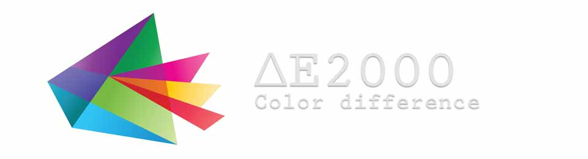

# The CIEDE2000 (ΔE00) Color Difference Formula

This [source code](https://bit.ly/ΔE) is not affiliated with the CIE (International Commission on Illumination), has not been validated by it, and is released into the public domain. It is provided "as is" without any warranty.

## Status

Choose your programming language, and it's ready to be deployed in **production** environments :

- Compliance with Bruce Lindbloom’s (Netflix’s VMAF, ...) implementation to **10<sup>-12</sup>** tested on billions of cases.
- Compliance with Gaurav Sharma’s (OpenJDK, ...) implementation to **10<sup>-12</sup>** tested on billions of cases.

## Version

This document describes the CIE ΔE2000 v1.0.0 functions, all accurate to 10 decimal places, released in March 2025.


**Overview** : The formula is an internationally recognized measure for comparing two colors in the CIELAB color space. It improves on its CIE94 predecessor by incorporating new adjustments, enabling more accurate color comparisons.

**Purpose** : The ΔE<sub>00</sub> algorithm, which is notorious for exhibiting discontinuities, is designed to reflect the difficulty of distinguishing between two colors, rather than being a locally smooth and uniform Euclidean metric.

**Nomenclature** : The terms CIE2000, CIEDE2000, ΔE<sub>00</sub>, ΔE\*<sub>00</sub>, and ΔE2000 are used interchangeably in this repository.

## Implementations

Engineered for precision and portability, this **reference** implementation of the **DeltaE 2000** formula achieves color difference calculations without dependencies, and supports a wide range of programming languages :

|Paradigm / Ecosystem|Programming Languages|
|--:|:--|
|Low-Level / Systems|[Ada](tests/adb#δe2000--accurate-fast-ada-powered) … [C](tests/c#δe2000--accurate-fast-c-powered) … [C++](tests/cpp#δe2000--accurate-fast-c-powered) … [D](tests/d#δe2000--accurate-fast-d-powered) … [Go](tests/go#δe2000--accurate-fast-go-powered) … [Rust](tests/rs#δe2000--accurate-fast-rust-powered) … [Swift](tests/swift#δe2000--accurate-fast-swift-powered) … [Zig](tests/zig#δe2000--accurate-fast-zig-powered)|
|General Purpose / Scripting|[Dart](tests/dart#δe2000--accurate-fast-dart-powered) … [JavaScript](tests/js#δe2000--accurate-fast-javascript-powered) … [Lua](tests/lua#δe2000--accurate-fast-lua-powered) … [PHP](tests/php#δe2000--accurate-fast-php-powered) … [Perl](tests/pl#δe2000--accurate-fast-perl-powered) … [PowerShell](tests/ps1#δe2000--accurate-fast-powershell-powered) … [Python](tests/py#δe2000--accurate-fast-python-powered) <br> [Ruby](tests/rb#δe2000--accurate-fast-ruby-powered) … [TCL](tests/tcl#δe2000--accurate-fast-tcl-powered) … [TypeScript](tests/ts#δe2000--accurate-fast-typescript-powered) … [Wren](tests/wren#δe2000--accurate-fast-wren-powered)|
|Functional / Declarative|[Haskell](tests/hs#δe2000--accurate-fast-haskell-powered) … [Haxe](tests/hx#δe2000--accurate-fast-haxe-powered) … [Nim](tests/nim#δe2000--accurate-fast-nim-powered) … [Prolog](tests/pro#δe2000--accurate-fast-prolog-powered) … [Racket](tests/rkt#δe2000--accurate-fast-racket-powered)|
|VM-Based|[C#](tests/cs#δe2000--accurate-fast-c-powered) … [Elixir](tests/exs#δe2000--accurate-fast-elixir-powered) … [F#](tests/fs#δe2000--accurate-fast-f-powered) … [Java](tests/java#δe2000--accurate-fast-java-powered) … [Kotlin](tests/kt#δe2000--accurate-fast-kotlin-powered) … [Scala](tests/scala#δe2000--accurate-fast-scala-powered) … [VBA](tests/bas#δe2000--accurate-fast-vba-powered)|
|Scientific / Analytical|[bc](tests/bc#δe2000--accurate-fast-bc-powered) … [Excel](tests/xls#δe2000--accurate-fast-excel-powered) … [Julia](tests/jl#δe2000--accurate-fast-julia-powered) … [MATLAB](tests/m#δe2000--accurate-fast-matlab-powered) … [Mathematica](tests/wl#δe2000--accurate-fast-mathematica-powered) … [R](tests/r#δe2000--accurate-fast-r-powered)|
|Legacy / Query|[ASP](tests/asp#δe2000--accurate-fast-asp-powered) … [AWK](tests/awk#δe2000--accurate-fast-awk-powered) … [Fortran](tests/f90#δe2000--accurate-fast-fortran-powered) … [Pascal](tests/pas#δe2000--accurate-fast-pascal-powered) … [SQL](tests/sql#δe2000--accurate-fast-sql-powered)|

**Quality Assurance** : These implementations are validated to an accuracy of 10<sup>-10</sup> against calculations performed by Netflix’s Emmy Awarded **VMAF library** and the trusted **npm/chroma-js**, calculations performed by **Fogra** (a reputed institution in the graphics and printing industry), and, for example, also with the **California Institute of Technology**’s ΔE00 calculations — guaranteeing their [scientific](tests/m#comparison-with-wagenaarlab) rigor and [practical](tests/c#comparison-with-the-vmaf-c99-library) reliability in the face of the zero errors observed.

**Note** : Each source contains the definition of the two main variants (both correct in practice) of the ΔE\*<sub>00</sub> algorithm. For example, OpenJDK uses a function named `cie00`, which corresponds to the line currently commented on.

<details>
<summary>Explain precisely what differs in the source code between the two main variants !</summary>

Online, we can see a live difference of [±0.0002](https://michel-leonard.github.io/ciede2000-color-matching/lab-color-calculator.html?L1=34.6&a1=1.4&b1=-12.5&L2=36.4&a2=13.8&b2=123.6) in the ΔE2000 between the two variants. Turning to the technical side, the modification, here in Java language, to switch from one variant of the ΔE\*<sub>00</sub> algorithm to the other is as follows.

#### Syntax for switching between variants

```diff
- h_m += Math.PI;                                // Bruce Lindbloom, Netflix’s VMAF, ...
+ h_m += h_m < Math.PI ? Math.PI : -Math.PI;     // Gaurav Sharma, OpenJDK, ...
```

✅ Applying this predefined modification results in ΔE2000 compliance with Gaurav Sharma with a tolerance of **10<sup>-12</sup>**.

> The current variant is suitable for production workflows, the other one is clearer for metrological applications. Historically, these two variants are the result of a coding simplification inherited from the first implementations. The choice to prefer one over the other depends on the desired interoperability, but they differ by only ±0.0003 (same as the typical 32-bit float precision), which underlines the sufficiency of the 32-bit `ciede_2000` functions.
</details>

## RGB and Hexadecimal Color Comparison for the Web in JavaScript

[Just 3kb](https://cdn.jsdelivr.net/gh/michel-leonard/ciede2000-color-matching@latest/docs/assets/scripts/ciede-2000.min.js) - Simple. Fast. Easy to use. This JavaScript function accepts both **RGB** and **hexadecimal color formats** and computes the color difference using the CIE ΔE 2000 formula and the standard illuminant D65 :
```js
// This function written in JavaScript is not affiliated with the CIE (International Commission on Illumination),
// and is released into the public domain. It is provided "as is" without any warranty, express or implied.
function ciede_2000(a,b,c,d,e,f){"use strict";var k_l=1.0,k_c=1.0,k_h=1.0,g,h,i,j,k,l,m,n,o,p,q,r,s=0.040448236277105097;if(typeof a=='string'){g=parseInt((a.length===4?a[0]+a[1]+a[1]+a[2]+a[2]+a[3]+a[3]:a).substring(1),16);if(typeof b=='string'){h=parseInt((b.length===4?b[0]+b[1]+b[1]+b[2]+b[2]+b[3]+b[3]:b).substring(1),16);d=h>>16&0xff;e=h>>8&0xff;f=h&0xff;}else{f=d;e=c;d=b;}a=g>>16&0xff;b=g>>8&0xff;c=g&0xff}else if(typeof d=='string'){g=parseInt((d.length===4?d[0]+d[1]+d[1]+d[2]+d[2]+d[3]+d[3]:d).substring(1),16);d=g>>16&0xff;e=g>>8&0xff;f=g&0xff;}a/=255.0;b/=255.0;c/=255.0;a=a<s?a/12.92:Math.pow((a+0.055)/1.055,2.4);b=b<s?b/12.92:Math.pow((b+0.055)/1.055,2.4);c=c<s?c/12.92:Math.pow((c+0.055)/1.055,2.4);g=a*41.24564390896921145+b*35.75760776439090507+c*18.04374830853290341;h=a*21.26728514056222474+b*71.51521552878181013+c*7.21749933075596513;i=a*1.93338955823293176+b*11.91919550818385936+c*95.03040770337479886;a=g/95.047;b=h/100.0;c=i/108.883;a=a<216.0/24389.0?((841.0/108.0)*a)+(4.0/29.0):Math.cbrt(a);b=b<216.0/24389.0?((841.0/108.0)*b)+(4.0/29.0):Math.cbrt(b);c=c<216.0/24389.0?((841.0/108.0)*c)+(4.0/29.0):Math.cbrt(c);g=(116.0*b)-16.0;h=500.0*(a-b);i=200.0*(b-c);d/=255.0;e/=255.0;f/=255.0;d=d<s?d/12.92:Math.pow((d+0.055)/1.055,2.4);e=e<s?e/12.92:Math.pow((e+0.055)/1.055,2.4);f=f<s?f/12.92:Math.pow((f+0.055)/1.055,2.4);j=d*41.24564390896921145+e*35.75760776439090507+f*18.04374830853290341;k=d*21.26728514056222474+e*71.51521552878181013+f*7.21749933075596513;l=d*1.93338955823293176+e*11.91919550818385936+f*95.03040770337479886;d=j/95.047;e=k/100.0;f=l/108.883;d=d<216.0/24389.0?((841.0/108.0)*d)+(4.0/29.0):Math.cbrt(d);e=e<216.0/24389.0?((841.0/108.0)*e)+(4.0/29.0):Math.cbrt(e);f=f<216.0/24389.0?((841.0/108.0)*f)+(4.0/29.0):Math.cbrt(f);j=(116.0*e)-16.0;k=500.0*(d-e);l=200.0*(e-f);d=(Math.sqrt(h*h+i*i)+Math.sqrt(k*k+l*l))*0.5;d=d*d*d*d*d*d*d;d=1.0+0.5*(1.0-Math.sqrt(d/(d+6103515625.0)));m=Math.sqrt(h*h*d*d+i*i);n=Math.sqrt(k*k*d*d+l*l);o=Math.atan2(i,h*d);p=Math.atan2(l,k*d);o+=2.0*Math.PI*(o<0.0);p+=2.0*Math.PI*(p<0.0);d=Math.abs(p-o);if(Math.PI-1E-14<d&&d<Math.PI+1E-14)d=Math.PI;q=(o+p)*0.5;r=(p-o)*0.5;if(Math.PI<d){r+=Math.PI;q+=Math.PI;}e=36.0*q-55.0*Math.PI;d=(m+n)*0.5;d=d*d*d*d*d*d*d;s=-2.0*Math.sqrt(d/(d+6103515625.0))*Math.sin(Math.PI/3.0*Math.exp(e*e/(-25.0*Math.PI*Math.PI)));d=(g+j)*0.5;d=(d-50.0)*(d-50.0);f=(j-g)/(k_l*(1.0+0.015*d/Math.sqrt(20.0+d)));a=1.0+0.24*Math.sin(2.0*q+Math.PI*0.5)+0.32*Math.sin(3.0*q+8.0*Math.PI/15.0)-0.17*Math.sin(q+Math.PI/3.0)-0.20*Math.sin(4.0*q+3.0*Math.PI/20.0);d=m+n;b=2.0*Math.sqrt(m*n)*Math.sin(r)/(k_h*(1.0+0.0075*d*a));c=(n-m)/(k_c*(1.0+0.0225*d));return Math.sqrt(f*f+b*b+c*c+c*b*s);}

```

For reference, the biggest color difference between lime green (#9f0) and dark navy (#006) yields a ΔE<sub>00</sub> value of 119. Lower values indicate more similar colors, making it easy to determine the closest match to a given color.

### Use Cases

These [examples with CDN](https://michel-leonard.github.io/ciede2000-color-matching/assets/html/with-javascript-cdn.html) show how to compare different combinations of RGB and Hex color formats :

#### Example 1 : Compare Hex vs Hex
```js
// black compared to white
var delta_e = ciede_2000('#000', '#FFF')
// ΔE2000 = 100.0 — classical reference
```

#### Example 2 : Compare Hex vs RGB
```js
// darkslateblue compared to indigo
var delta_e = ciede_2000('#483d8b', 75,0,130)
// ΔE2000 ≈ 12.19 — distinct difference
```

#### Example 3 : Compare RGB vs Hex
```js
// indigo compared to darkblue
var delta_e = ciede_2000(75, 0, 130, '#00008b')
// ΔE2000 ≈ 7.72 — moderate difference
```

#### Example 4 : Compare RGB vs RGB
```js
// darkblue compared to navy
var delta_e = ciede_2000(0, 0, 139, 0, 0, 128)
// ΔE2000 ≈ 1.56 — slight difference
```

### ⚡ Performance

Master colors with ease right now with this ΔE2000 JavaScript function that accepts RGB and hexadecimal colors, and performs around **1,000,000 comparisons in ~500 ms** on modern browsers, making it suitable for real-time tasks.

## Possible Usage

- **Precision**: Medical image processing (shade differences between healthy and diseased tissues).
- **Efficiency**: Machine vision (color-based quality control).
- **Everywhere**: Leading the way in innovative color science and multi-language integration solutions.

The textile industry usually adjusts `k_l` to `2.0` in the source code for its needs.



### Live Examples

Based on our JavaScript implementation, you can see the CIEDE2000 color difference formula in action here :
- **Generators** :
  - A [discovery generator](https://michel-leonard.github.io/ciede2000-color-matching/discovery-generator.html) for quick, small-scale testing and exploration.
  - A [large-scale generator](https://michel-leonard.github.io/ciede2000-color-matching) and validator used to test new implementations.
  - A [ΔE-to-RGB pairs generator](https://michel-leonard.github.io/ciede2000-color-matching/de2000-rgb-pairs.html) that shows RGB color pairs sharing a given ΔE2000 value (±0.05).
- **Calculators**:
  - A [simple calculator](https://michel-leonard.github.io/ciede2000-color-matching/lab-color-calculator.html) that shows in 10 steps how to compute ΔE2000 between two **L\*a\*b\*** colors.
  - A [pickers-based calculator](https://michel-leonard.github.io/ciede2000-color-matching/rgb-hex-color-calculator.html) for computing ΔE2000 between two **RGB** or **Hex** colors.
- **Other** :
  - A [tool](https://michel-leonard.github.io/ciede2000-color-matching/color-name-from-image.html) that identify the name of the selected color based on a picture.

## Testing and Validation

To ensure accurate color evaluation, [extensive tests](tests#ciede-2000-function-test) involving hundreds of billions of colors were carried out, including precise comparisons with major libraries. The consistency of the ΔE*<sub>00</sub> function across languages is fundamental here.

- **Test cases** : Each programming language was tested on hundreds of millions of L\*a\*b\* color pairs.
- **Tolerance** : All programming languages are capable of producing the correct results with a tolerance of `1e-10`.
- **Workflow** : All programming languages have their own dedicated test involving 20M new colors every month.

> In summary, the absolute value of the deviation in ΔE2000 between two implementations never exceeds 10<sup>-10</sup>.

**Correctness** : Today, the world’s leading companies rely on the CIE2000 formula, and are encouraged, along with software developers, to carry out tests that reveal the inconsistencies between different implementations.

### Numerical Stability in CIEDE2000

To confirm its exceptional accuracy, the JavaScript implementation was subjected to an endurance test against an old and reliable reference. No deviation greater than **10<sup>-12</sup>** was detected in ΔE00s over the **80,000,000,000,000** random color pairs tested. Minor differences were attributed to degree-to-radian conversions in the reference calculations.

#### Angle Conversions

> Finally, you've here the right implementation of ΔE2000, which completely eliminates degree/radian conversions.

The professional approach in software is to use radians for mathematical calculations, as angle conversions, while theoretically valid, result in a loss of precision due to rounding errors in floating-point numbers. Here, only radians are used, without conversion, but this can be a source of inconsistency for an external implementation.

For example, we rely on `value > π` in radians, which is the same as `value > 180` in degrees. Due to conversions, an implementation [using degrees](http://www.brucelindbloom.com/index.html?ColorDifferenceCalc.html) may obtain `180.00000000000003`, while its equivalent [in radians](https://michel-leonard.github.io/ciede2000-color-matching/lab-color-calculator.html?L1=88&a1=-124&b1=56&L2=97&a2=62&b2=-28) would have given exactly `π = 3.141592653589793`, leading to different [branching](ciede-2000.js#L32) and discrepancies in the calculated ΔE CIE2000.

#### Angle Computations

In most environments, when **a\*** and **b\*** are both zero, `atan2(0, 0)` correctly evaluates to `0`, following mathematical convention, as in [JavaScript](https://michel-leonard.github.io/ciede2000-color-matching/lab-color-calculator.html?L1=1&a1=0&b1=0&L2=2&a2=0&b2=0). However, some programming languages may instead throw an exception or return `NaN` or `NULL`, and so patches are [in place](ciede-2000.sql#L30) to ensure totally reliable implementations. In addition, during automated tests, the C driver generates cases that confirm in each programming language that, although the result of `atan2(0, 0)` differs from that of `atan2(0, -0)`, this has no influence on the final CIE ΔE\*<sub>00</sub> color difference.

<details>
<summary>Shows ambiguous cases related to angular calculations where the color difference is unstable !</summary>

These discontinuities occur when the `a1 / b1` equals `a2 / b2` and the signs of `a1` and `a2` are opposite, then an infinitesimal variation in these components can produce a large variation in ΔE2000, as can be seen in the links.

| Lower value | Upper value | Non-continuous change in ΔE2000 |
|:--:|:--:|:--:|
| [0.69](https://michel-leonard.github.io/ciede2000-color-matching/lab-color-calculator.html?L1=0&a1=0.192&b1=-0.195&L2=0&a2=-0.192&b2=0.195) | [0.693](https://michel-leonard.github.io/ciede2000-color-matching/lab-color-calculator.html?L1=0&a1=0.192&b1=-0.195&L2=0&a2=-0.192&b2=0.19500000000001) | 0.5% |
| [1.39](https://michel-leonard.github.io/ciede2000-color-matching/lab-color-calculator.html?L1=0&a1=0.391&b1=-0.394&L2=0&a2=-0.391&b2=0.394) | [1.404](https://michel-leonard.github.io/ciede2000-color-matching/lab-color-calculator.html?L1=0&a1=0.391&b1=-0.394&L2=0&a2=-0.391&b2=0.39400000000001) | 1% |
| [2.79](https://michel-leonard.github.io/ciede2000-color-matching/lab-color-calculator.html?L1=0&a1=0.8&b1=-0.792&L2=0&a2=-0.805&b2=0.79695) | [2.85](https://michel-leonard.github.io/ciede2000-color-matching/lab-color-calculator.html?L1=0&a1=0.8&b1=-0.792&L2=0&a2=-0.805&b2=0.7969500000001) | 2% |
| [5.6](https://michel-leonard.github.io/ciede2000-color-matching/lab-color-calculator.html?L1=0&a1=1.65&b1=-1.68&L2=0&a2=-1.65&b2=1.68) | [5.8](https://michel-leonard.github.io/ciede2000-color-matching/lab-color-calculator.html?L1=0&a1=1.65&b1=-1.68&L2=0&a2=-1.65&b2=1.6800000000001) | 4% |
| [11.3](https://michel-leonard.github.io/ciede2000-color-matching/lab-color-calculator.html?L1=0&a1=3.62&b1=-3.6&L2=0&a2=-3.62&b2=3.6) | [12.3](https://michel-leonard.github.io/ciede2000-color-matching/lab-color-calculator.html?L1=0&a1=3.62&b1=-3.6&L2=0&a2=-3.62&b2=3.6000000000001) | 9% |
| **[16.1](https://michel-leonard.github.io/ciede2000-color-matching/lab-color-calculator.html?L1=0&a1=124&b1=6.2&L2=0&a2=-4.9&b2=-0.2450000000001)** | **[43.2](https://michel-leonard.github.io/ciede2000-color-matching/lab-color-calculator.html?L1=0&a1=124&b1=6.2&L2=0&a2=-4.9&b2=-0.245)** | **168%** |
| [22.7](https://michel-leonard.github.io/ciede2000-color-matching/lab-color-calculator.html?L1=0&a1=-10&b1=0.3&L2=0&a2=127&b2=-3.81) | [52.4](https://michel-leonard.github.io/ciede2000-color-matching/lab-color-calculator.html?L1=0&a1=-10&b1=0.300000000001&L2=0&a2=127&b2=-3.81) | 131% |
| [66.6](https://michel-leonard.github.io/ciede2000-color-matching/lab-color-calculator.html?L1=0&a1=-128&b1=86.4&L2=0&a2=127&b2=-85.725) | [125.6](https://michel-leonard.github.io/ciede2000-color-matching/lab-color-calculator.html?L1=0&a1=-128&b1=86.40000000001&L2=0&a2=127&b2=-85.725) | 89% |
| [90.5](https://michel-leonard.github.io/ciede2000-color-matching/lab-color-calculator.html?L1=0&a1=-128&b1=-61.6&L2=0&a2=126.8&b2=61.0225) | [154.6](https://michel-leonard.github.io/ciede2000-color-matching/lab-color-calculator.html?L1=0&a1=-128&b1=-61.60000000001&L2=0&a2=126.8&b2=61.0225) | 71% |

</details>

#### IEEE 754 floating-point Limitations

Minor discrepancies can arise between programming languages, for instance, `atan2(-49.2, -34.9)` evaluates to `-2.1877696633888672` in Python and `-2.1877696633888677` in JavaScript, while `-2.187769663388867475...` is correct. Here, tolerated deviation for a cross-language exact color match is set to `1e-10`, linking sufficiency and achievability.

#### Numerical Precision: 32-bit vs 64-bit

The formula ΔE2000 involves numerically sensitive calculations, particularly those related to angles and  π. In 32-bit floating point, the rounding at each step can, when comparing two implementations, cause the conditional logic to move to a different branch of execution. Once in a different branch, the result may diverge, but this is more a natural consequence of the formula’s structure than a bug. These are not really errors, but rather expected discrepancies due to precision limits, which occur under specific conditions that are not usually encountered.

##### Use the `ciede_2000` function in 32-bit rather than 64-bit

The original functions favor 64-bit precision, but 32-bit functions, which are also available, can give virtually identical results to 64-bit, while being faster with a lighter footprint. Let's look at this with randomly generated L\*a\*b\* values rounded to the nearest tenth (otherwise no "rare" deviation is noticed even when doing it with many more colors).

| Condition | Common deviation (most cases) | Rare deviation (1 in ≥1M cases) |
|:--:|:--:|:--:|
| `ΔE2000 < 5` | 0.00005 | 0.02 |
| `ΔE2000 < 10` | 0.00005 | 0.07 |
| `ΔE2000 < 15` | 0.00005 | 0.3 |
| `ΔE2000 < 20` | 0.00005 | 2.3 |
| `ΔE2000 < 40` | 0.00005 | 9.0 |

The exact conditions for triggering a "rare" deviation between 32 and 64 bits are unlikely to occur naturally, and are improbable in real data streams from sensors or color space conversions. This experiment, based on 100,000,000 color pairs meeting the condition, showed that 32-bit `ciede_2000` functions are suitable for serious applications.

#### Debugging

Rounding L\*a\*b\* components and ΔE 2000 to [4 decimal places](tests#roundings) can be a solution for realistic color comparisons.

### Performance Overview

Runtimes were recorded while calculating 100 million iterations of the color difference formula ΔE 2000.

| Language | Duration (mm:ss) | Performance factor compared to C |
|:--:|:--:|:--:|
C | 00:13 | Reference |
Kotlin | 00:15 | 1.09× slower |
VBA | 00:15 | 1.14× slower |
Lua | 00:15 | 1.15× slower |
Dart | 00:16 | 1.19× slower |
Rust | 00:17 | 1.28× slower |
Nim | 00:18 | 1.34× slower |
Go | 00:19 | 1.40× slower |
Haxe | 00:19 | 1.42× slower |
F# | 00:19 | 1.42× slower |
D | 00:21 | 1.54× slower |
Java | 00:23 | 1.76× slower |
Julia | 00:24 | 1.82× slower |
C++ | 00:24 | 1.83× slower |
JavaScript | 00:31 | 2.30× slower |
C# | 00:32 | 2.37× slower |
MATLAB | 00:33 | 2.49× slower |
Swift | 00:38 | 2.84× slower |
Fortran | 00:40 | 2.97× slower |
PHP | 00:44 | 3.32× slower |
Pascal | 00:49 | 3.67× slower |
Haskell | 01:08 | 5.09× slower |
Ruby | 03:21 | 15.11× slower |
Perl | 03:48 | 17.15× slower |
Python | 03:59 | 17.98× slower |
SQL | 05:39 | 25.45× slower |
AWK | 07:18 | 32.88× slower |
bc | 20:44:43 | 5612.28× slower |

## Contributing

Here are some examples of programming languages that could be used to expand the `ciede_2000` function :
- OCaml
- Crystal
- V

### Methodology

To ensure consistency across implementations, please follow these guidelines :
1. **Base your implementation** on an existing one, copy-pasting and adapting is encouraged.
2. **Validate correctness** basically using the [discovery generator](https://michel-leonard.github.io/ciede2000-color-matching/discovery-generator.html), and formally using the [large-scale generator](https://michel-leonard.github.io/ciede2000-color-matching) :
   - Generate 1,000,000 samples, or 10,000 if you encounter technical limitations.
   - Verify that the computed ΔE 2000 values do not deviate by more than **1e-10** from reference values.
3. **Submit a pull request** with your implementation.

To enhance your contribution, consider writing documentation, as done for other programming languages. Your source code, along with the others, will then be reviewed and made available in this public domain repository.

> [!NOTE]
> If the `atan2` function is not available to you, a polyfill is provided in the [bc](ciede-2000.bc#L28) version.

### Other way to contribute

Purchase the original CIE Technical Report [142-2001](https://store.accuristech.com/cie/standards/cie-142-2001?product_id=1210060). This document, without which this repository would not exist, specifically presents and formalizes the ΔE 2000 formula, providing guidelines on how to implement it.

## Source Code in C

Here is the **C99** source code from Michel Leonard to implement the **CIE ΔE 2000** function :

```c
// This function written in C is not affiliated with the CIE (International Commission on Illumination),
// and is released into the public domain. It is provided "as is" without any warranty, express or implied.

#include <math.h>

// Expressly defining pi ensures that the code works on different platforms.
#ifndef M_PI
#define M_PI 3.14159265358979323846264338328
#endif

// The classic CIE ΔE2000 implementation, which operates on two L*a*b* colors, and returns their difference.
// "l" ranges from 0 to 100, while "a" and "b" are unbounded and commonly clamped to the range of -128 to 127.
static double ciede_2000(const double l_1, const double a_1, const double b_1, const double l_2, const double a_2, const double b_2) {
	// Working in C with the CIEDE2000 color-difference formula.
	// k_l, k_c, k_h are parametric factors to be adjusted according to
	// different viewing parameters such as textures, backgrounds...
	const double k_l = 1.0;
	const double k_c = 1.0;
	const double k_h = 1.0;
	double n = (sqrt(a_1 * a_1 + b_1 * b_1) + sqrt(a_2 * a_2 + b_2 * b_2)) * 0.5;
	n = n * n * n * n * n * n * n;
	// A factor involving chroma raised to the power of 7 designed to make
	// the influence of chroma on the total color difference more accurate.
	n = 1.0 + 0.5 * (1.0 - sqrt(n / (n + 6103515625.0)));
	// Application of the chroma correction factor.
	const double c_1 = sqrt(a_1 * a_1 * n * n + b_1 * b_1);
	const double c_2 = sqrt(a_2 * a_2 * n * n + b_2 * b_2);
	// atan2 is preferred over atan because it accurately computes the angle of
	// a point (x, y) in all quadrants, handling the signs of both coordinates.
	double h_1 = atan2(b_1, a_1 * n);
	double h_2 = atan2(b_2, a_2 * n);
	h_1 += (h_1 < 0.0) * 2.0 * M_PI;
	h_2 += (h_2 < 0.0) * 2.0 * M_PI;
	n = fabs(h_2 - h_1);
	// Cross-implementation consistent rounding.
	if (M_PI - 1E-14 < n && n < M_PI + 1E-14)
		n = M_PI;
	// When the hue angles lie in different quadrants, the straightforward
	// average can produce a mean that incorrectly suggests a hue angle in
	// the wrong quadrant, the next lines handle this issue.
	double h_m = (h_1 + h_2) * 0.5;
	double h_d = (h_2 - h_1) * 0.5;
	h_d += (M_PI < n) * ((0.0 < h_d) - (h_d <= 0.0)) * M_PI;
	// 📜 Sharma’s formulation doesn’t use the next line, but the one after it,
	// and these two variants differ by ±0.0003 on the final color differences.
	h_m += (M_PI < n) * M_PI;
	// h_m += (M_PI < n) * ((h_m < M_PI) - (M_PI <= h_m)) * M_PI;
	const double p = 36.0 * h_m - 55.0 * M_PI;
	n = (c_1 + c_2) * 0.5;
	n = n * n * n * n * n * n * n;
	// The hue rotation correction term is designed to account for the
	// non-linear behavior of hue differences in the blue region.
	const double r_t = -2.0 * sqrt(n / (n + 6103515625.0))
			* sin(M_PI / 3.0 * exp(p * p / (-25.0 * M_PI * M_PI)));
	n = (l_1 + l_2) * 0.5;
	n = (n - 50.0) * (n - 50.0);
	// Lightness.
	const double l = (l_2 - l_1) / (k_l * (1.0 + 0.015 * n / sqrt(20.0 + n)));
	// These coefficients adjust the impact of different harmonic
	// components on the hue difference calculation.
	const double t = 1.0	+ 0.24 * sin(2.0 * h_m + M_PI / 2.0)
				+ 0.32 * sin(3.0 * h_m + 8.0 * M_PI / 15.0)
				- 0.17 * sin(h_m + M_PI / 3.0)
				- 0.20 * sin(4.0 * h_m + 3.0 * M_PI / 20.0);
	n = c_1 + c_2;
	// Hue.
	const double h = 2.0 * sqrt(c_1 * c_2) * sin(h_d) / (k_h * (1.0 + 0.0075 * n * t));
	// Chroma.
	const double c = (c_2 - c_1) / (k_c * (1.0 + 0.0225 * n));
	// Returning the square root ensures that dE00 accurately reflects the
	// geometric distance in color space, which can range from 0 to around 185.
	return sqrt(l * l + h * h + c * c + c * h * r_t);
}

#include <stdio.h>

int main(void) {
	// Compute the Delta E (CIEDE2000) color difference between two CIELAB colors.
	const double l1 = 28.9, a1 = 47.5, b1 = 2.0;
	const double l2 = 28.8, a2 = 41.6, b2 = -1.7;
	const double delta_e = ciede_2000(l1, a1, b1, l2, a2, b2);
	printf("  l1 = %-9g a1 = %-9g b1 = %-9g\n", l1, a1, b1);
	printf("  l2 = %-9g a2 = %-9g b2 = %-9g\n", l2, a2, b2);
	printf("dE00 = %.11g\n", delta_e);
	// .................................................. This shows a ΔE2000 of 2.7749016764
	// As explained in the comments, compliance with Gaurav Sharma would display 2.7749152801
}
```

### Quick Online Demo

You can use an [online compiler](https://www.google.com/search?q=Online+C+Compiler) to see the demonstration, just **copy/paste** to get the same results as below.

### Compilation Demo

Once you've placed the source code in the `ciede-2000.c` file, and after navigating (using Terminal in Linux/Mac or PowerShell in Windows) to the appropriate directory, run one of the following compilation commands :
- `gcc -std=c99 -Wall -Wextra -pedantic -Ofast -o ciede-2000-compiled ciede-2000.c -lm`
- `clang -std=c99 -Wall -Wextra -pedantic -Ofast -o ciede-2000-compiled ciede-2000.c -lm`

Running the program via `./ciede-2000-compiled` then results in the following color difference being displayed :

```text
  l1 = 28.9      a1 = 47.5      b1 = 2
  l2 = 28.8      a2 = 41.6      b2 = -1.7
dE00 = 2.7749016764
```

### Conclusion

With the explosion of software innovation in the 2030s, this ΔE<sub>00</sub> function is the definitive answer to the best color difference equation, offering the advantage of being correct without ever ceasing to boost developer productivity.

## Internet Archive

For these CIE ΔE2000 functions, an archived version of the source code is available at `https://web.archive.org/https://raw.githubusercontent.com/michel-leonard/ciede2000-color-matching/refs/heads/main/ciede-2000.c`. To access a different version, simply replace the `.c` extension in the URL with the desired file extension.

## Short URL
Quickly share this GitHub project permanently using [bit.ly/color-difference](https://bit.ly/color-difference).

<!-- Author historical ID: ktm620enduro -->
