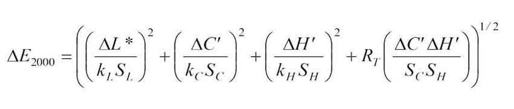

# CIEDE2000 Color-Difference

This [source code](https://bit.ly/ΔE) is not affiliated with the CIE (International Commission on Illumination), has not been validated by it, and is released into the public domain. It is provided "as is" without any warranty.

## Status

Fully tested — Ready to be deployed in **production** environments.

## Version

This document describes the CIE ΔE00 functions v1.0.0, released on March 1, 2025.



**Overview**: The formula is a modern metric for comparing two colors in the CIELAB color space, which improves on the earlier CIE76 formula by integrating new perceptual factors, resulting in more accurate color comparisons.

## Implementations
Lightweight and reliable, this **reference** implementation of the **Delta E 2000** formula delivers consistent results to 10 decimal places across multiple programming languages :

- **Enterprise and Web Development** (ΔE00):
	- [Java](tests/java#δe2000--accurate-fast-java-powered), [Kotlin](tests/kt#δe2000--accurate-fast-kotlin-powered)
	- [C#](tests/cs#δe2000--accurate-fast-c-powered)
	- [JavaScript](tests/js#-flexibility), [TypeScript](tests/ts#δe2000--accurate-fast-typescript-powered)
	- [PHP](tests/php#δe2000--accurate-fast-php-powered)
	- [Python](tests/py#δe2000--accurate-fast-python-powered)
	- [Ruby](tests/rb#δe2000--accurate-fast-ruby-powered)
	- [Dart](tests/dart#δe2000--accurate-fast-dart-powered)
	- [ASP](ciede-2000.asp#L10), VBScript
	- [Lua](tests/lua#δe2000--accurate-fast-lua-powered), LuaJIT
	- [Haxe](tests/hx#δe2000--accurate-fast-haxe-powered)
	- [Perl](tests/pl#δe2000--accurate-fast-perl-powered)
	- [AWK](tests/awk#δe2000--accurate-fast-awk-powered)
	- [SQL](tests/sql#δe2000--accurate-fast-sql-powered)
	- [Pascal](tests/pas#δe2000--accurate-fast-pascal-powered)

- **Systems and Performance-Critical Programming** (ΔE00):
	- [C](tests/c#δe2000--accurate-fast-c-powered), C++
	- [D](tests/d#δe2000--accurate-fast-d-powered)
	- [Rust](tests/rs#δe2000--accurate-fast-rust-powered)
	- [Go](tests/go#δe2000--accurate-fast-go-powered)
	- [Swift](tests/swift#δe2000--accurate-fast-swift-powered)
	- [Nim](tests/nim#δe2000--accurate-fast-nim-powered)
	- [Zig](tests/zig#δe2000--accurate-fast-zig-powered)
	- [Wren](tests/wren#δe2000--accurate-fast-wren-powered)

-  **Scientific Computing and Data Analysis** (ΔE00):
	- [Fortran](tests/f90#δe2000--accurate-fast-fortran-powered)
	- [MATLAB](tests/m#δe2000--accurate-fast-matlab-powered)
	- [Mathematica](tests/wls#δe2000--accurate-fast-mathematica-powered), Wolfram Language
	- [R](tests/r#δe2000--accurate-fast-r-powered)
	- [Julia](tests/jl#δe2000--accurate-fast-julia-powered)
	- [F#](tests/fs#δe2000--accurate-fast-f-powered)
	- [Racket](tests/rkt#δe2000--accurate-fast-racket-powered)
	- [Excel](tests/xls#δe2000--accurate-fast-excel-powered)
	- [VBA](tests/bas#δe2000--accurate-fast-vba-powered)

These classical implementations of the CIEDE2000 color difference formula are [completely](tests#comparison-with-university-of-rochester-worked-examples) consistent with the samples studied by Gaurav Sharma, Wencheng Wu, and Edul N. Dalal at the University of Rochester.

## RGB and Hexadecimal Color Comparison for the Web in JavaScript

[Just 3kb](https://cdn.jsdelivr.net/gh/michel-leonard/ciede2000-color-matching@latest/docs/assets/scripts/ciede-2000.min.js) - Simple. Fast. Easy to use. This JavaScript function accepts both **RGB** and **hexadecimal color formats** and computes the color difference using the CIE ΔE 2000 formula :
```js
// This function written in JavaScript is not affiliated with the CIE (International Commission on Illumination),
// and is released into the public domain. It is provided "as is" without any warranty, express or implied.
function ciede_2000(a,b,c,d,e,f){"use strict";var k_l=1.0,k_c=1.0,k_h=1.0,g,h,i,j,k,l,m,n,o,p,q,r,s=0.040448236276933;if(typeof a=='string'){g=parseInt((a.length===4?a[0]+a[1]+a[1]+a[2]+a[2]+a[3]+a[3]:a).substring(1),16);if(typeof b=='string'){h=parseInt((b.length===4?b[0]+b[1]+b[1]+b[2]+b[2]+b[3]+b[3]:b).substring(1),16);d=h>>16&0xff;e=h>>8&0xff;f=h&0xff;}else{f=d;e=c;d=b;}a=g>>16&0xff;b=g>>8&0xff;c=g&0xff}else if(typeof d=='string'){g=parseInt((d.length===4?d[0]+d[1]+d[1]+d[2]+d[2]+d[3]+d[3]:d).substring(1),16);d=g>>16&0xff;e=g>>8&0xff;f=g&0xff;}a/=255.0;b/=255.0;c/=255.0;a=a<s?a/12.92:Math.pow((a+0.055)/1.055,2.4);b=b<s?b/12.92:Math.pow((b+0.055)/1.055,2.4);c=c<s?c/12.92:Math.pow((c+0.055)/1.055,2.4);g=a*41.24564390896921145+b*35.75760776439090507+c*18.04374830853290341;h=a*21.26728514056222474+b*71.51521552878181013+c*7.21749933075596513;i=a*1.93338955823293176+b*11.91919550818385936+c*95.03040770337479886;a=g/95.047;b=h/100.000;c=i/108.883;a=a<216.0/24389.0?((841.0/108.0)*a)+(4.0/29.0):Math.cbrt(a);b=b<216.0/24389.0?((841.0/108.0)*b)+(4.0/29.0):Math.cbrt(b);c=c<216.0/24389.0?((841.0/108.0)*c)+(4.0/29.0):Math.cbrt(c);g=(116.0*b)-16.0;h=500.0*(a-b);i=200.0*(b-c);d/=255.0;e/=255.0;f/=255.0;d=d<s?d/12.92:Math.pow((d+0.055)/1.055,2.4);e=e<s?e/12.92:Math.pow((e+0.055)/1.055,2.4);f=f<s?f/12.92:Math.pow((f+0.055)/1.055,2.4);j=d*41.24564390896921145+e*35.75760776439090507+f*18.04374830853290341;k=d*21.26728514056222474+e*71.51521552878181013+f*7.21749933075596513;l=d*1.93338955823293176+e*11.91919550818385936+f*95.03040770337479886;d=j/95.047;e=k/100.000;f=l/108.883;d=d<216.0/24389.0?((841.0/108.0)*d)+(4.0/29.0):Math.cbrt(d);e=e<216.0/24389.0?((841.0/108.0)*e)+(4.0/29.0):Math.cbrt(e);f=f<216.0/24389.0?((841.0/108.0)*f)+(4.0/29.0):Math.cbrt(f);j=(116.0*e)-16.0;k=500.0*(d-e);l=200.0*(e-f);d=(Math.hypot(h,i)+Math.hypot(k,l))*0.5;d=d*d*d*d*d*d*d;d=1.0+0.5*(1.0-Math.sqrt(d/(d+6103515625.0)));m=Math.hypot(h*d,i);n=Math.hypot(k*d,l);o=Math.atan2(i,h*d);p=Math.atan2(l,k*d);o+=2.0*Math.PI*(o<0.0);p+=2.0*Math.PI*(p<0.0);d=Math.abs(p-o);if(Math.PI-1E-14<d&&d<Math.PI+1E-14)d=Math.PI;q=(o+p)*0.5;r=(p-o)*0.5;if(Math.PI<d){if(0.0<r)r-=Math.PI;else r+=Math.PI;q+=Math.PI;}e=36.0*q-55.0*Math.PI;d=(m+n)*0.5;d=d*d*d*d*d*d*d;s=-2.0*Math.sqrt(d/(d+6103515625.0))*Math.sin(Math.PI/3.0*Math.exp(e*e/(-25.0*Math.PI*Math.PI)));d=(g+j)*0.5;d=(d-50.0)*(d-50.0);f=(j-g)/(k_l*(1.0+0.015*d/Math.sqrt(20.0+d)));a=1.0+0.24*Math.sin(2.0*q+Math.PI*0.5)+0.32*Math.sin(3.0*q+8.0*Math.PI/15.0)-0.17*Math.sin(q+Math.PI/3.0)-0.20*Math.sin(4.0*q+3.0*Math.PI/20.0);d=m+n;b=2.0*Math.sqrt(m*n)*Math.sin(r)/(k_h*(1.0+0.0075*d*a));c=(n-m)/(k_c*(1.0+0.0225*d));return Math.sqrt(f*f+b*b+c*c+c*b*s);}
```

For reference, the maximum possible contrast between white (#fff) and black (#000) yields a ΔE2000 value of 100. Lower values indicate more similar colors, making it easy to determine the closest match to a given color.

### Use Cases

These [examples](https://michel-leonard.github.io/ciede2000-color-matching/assets/html/compare-hex-rgb-colors.html) show how to compare different combinations of RGB and Hex color formats :

#### Example 1 : Compare Hex vs Hex
```js
// blue compared to darkslateblue
var delta_e = ciede_2000('#00F', '#483D8B')
// ΔE2000 ≈ 15.91 — noticeable difference
```

#### Example 2 : Compare Hex vs RGB
```js
// darkslateblue compared to indigo
var delta_e = ciede_2000('#483d8b', 75,0,130)
// ΔE2000 ≈ 12.19 — distinct difference
```

#### Example 3 : Compare RGB vs Hex
```js
// indigo compared to darkblue
var delta_e = ciede_2000(75, 0, 130, '#00008b')
// ΔE2000 ≈ 7.72 — moderate difference
```

#### Example 4 : Compare RGB vs RGB
```js
// darkblue compared to navy
var delta_e = ciede_2000(0, 0, 139, 0, 0, 128)
// ΔE2000 ≈ 1.56 — slight difference
```

### ⚡ Performance

 Shrink time-to-market up to 5x with this JavaScript ΔE2000 color difference function, which works with RGB and hex colors and computes around **1,000,000 values in ~500 ms** on modern browsers, making it suitable for real-time tasks.

## Possible Usage

- **Precision**: Medical image processing (shade differences between healthy and diseased tissues).
- **Efficiency**: Machine vision (color-based quality control).
- **Everywhere**: Leading the way in innovative color science and multi-language integration solutions.

The textile industry usually adjusts `k_l` to `2.0` in the source code for its needs.

### Live Examples

Based on our JavaScript implementation, you can see the CIEDE2000 color difference formula in action here :
- **Generators** :
  - A [discovery generator](https://michel-leonard.github.io/ciede2000-color-matching/discovery-generator.html) for quick, small-scale testing and exploration.
  - A [large-scale generator](https://michel-leonard.github.io/ciede2000-color-matching) and validator used to test new implementations.
- **Calculators**:
  - A [simple calculator](https://michel-leonard.github.io/ciede2000-color-matching/lab-color-calculator.html) for computing ΔE2000 between two **L\*a\*b\*** colors.
  - A [pickers-based calculator](https://michel-leonard.github.io/ciede2000-color-matching/rgb-hex-color-calculator.html) for computing ΔE2000 between two **RGB** or **Hex** colors.
- **Other** :
  - A [tool](https://michel-leonard.github.io/ciede2000-color-matching/color-name-from-image.html) that identify the name of the selected color based on a picture.

## Testing and Validation

To ensure accurate color evaluation, [extensive testing](tests#ciede-2000-function-test) involving **1,365,000,000** comparisons has been conducted. Correctness and consistency of ΔE00 implementations across all programming languages ​​are essential in this project :

- **Test Cases**: Each programming language generates a CSV file containing **7,500,000** random samples.
- **Tolerance**: All programming languages reproduce every sample, except their own, with a tolerance of 1e-10.
- **Cross-Language Consistency**: This procedure could be respected and extended to new programming languages.

In other words, the absolute value of the difference between any two implementations does not exceed 1e-10.

**Correctness**: The most valuable companies in the world today rely on ΔE2000 and are encouraged, along with software developers, to conduct tests that reveal what truly breaks consistency across different implementations.

### Numerical Stability in CIEDE2000

To confirm its exceptional accuracy, the JavaScript implementation was compared to an old and reliable reference, with no deviations greater than **1e-12** detected in ΔE00s across **80,000,000,000** random color pairs tested. Minor differences were attributed to degree-to-radian conversions in the reference calculations.

#### Angle Conversions

The professional approach in software is to use radians for mathematical calculations, because angle conversions, while theoretically valid, result in a loss of precision due to rounding errors in floating-point numbers. Here, only radians are used, without conversion, but this can be a source of inconsistencies for an external implementation.

As an example, we rely on `value > π` in radians, which is the same as `value > 180` in degrees. Due to conversions, an implementation [using degrees](http://www.brucelindbloom.com/index.html?ColorDifferenceCalc.html) may obtain `180.00000000000003`, while its equivalent [in radians](https://michel-leonard.github.io/ciede2000-color-matching/lab-color-calculator.html?L1=88&a1=-124&b1=56&L2=97&a2=62&b2=-28) would have given exactly `π = 3.141592653589793`, leading to different [branching](ciede-2000.js#L32) and discrepancies in the calculated ΔE 2000.

#### Angle Computations

In most environments, when **a\*** and **b\*** are both zero, `atan2(0, 0)` correctly evaluates to `0`, following mathematical convention, as in [JavaScript](https://michel-leonard.github.io/ciede2000-color-matching/lab-color-calculator.html?L1=1&a1=0&b1=0&L2=2&a2=0&b2=0). However, some programming languages may instead throw an exception or return `NaN` or `NULL`, and so patches (e.g., [null coalescing](ciede-2000.sql#L30)) may be necessary to ensure fully reliable implementations.

#### IEEE 754 floating-point Limitations

Minor discrepancies can arise between programming languages, for instance, `atan2(-49.2, -34.9)` evaluates to `-2.1877696633888672` in Python and `-2.1877696633888677` in JavaScript, while `-2.187769663388867475...` is correct. Here, tolerated deviation for a cross-language exact color match is set to `1e-10`, linking sufficiency and achievability.

#### Numerical Precision: 32-bit vs 64-bit

Current implementations, which emphasize precision, use **64-bit floating point numbers**. However, it has been noted that using 32-bit numbers results in an almost always negligible difference of ±0.0002 in the calculated Delta E 2000.

#### Debugging

Rounding L\*a\*b\* components and ΔE 2000 to [4 decimal places](tests#roundings) can be a solution for realistic color comparisons.

### Performance Overview

Runtimes were recorded while calculating 100 million iterations of the color difference formula ΔE 2000.

| Language | Compilation Type | Duration (mm:ss) | Performance factor compared to C |
|:--:|:--:|:--:|:--:|
| C | Compiled| 00:45 | 1× ([Reference](https://bit.ly/ΔE2000)) |
| Rust | Compiled | 00:52 | 1.15× slower |
| Go | Compiled | 00:52 | 1.15× slower |
| LuaJIT | Just-In-Time Compiled | 00:53 | 1.18× slower |
| Java | Just-In-Time Compiled | 00:57 | 1.25× slower |
| Kotlin |  Just-In-Time Compiled | 00:57 | 1.26× slower |
| MATLAB | Interpreted | 01:06 | 1.46× slower |
| TypeScript | Just-In-Time Compiled| 01:17 | 1.7× slower |
| JavaScript | Just-In-Time Compiled | 01:18 | 1.73× slower |
| PHP | Interpreted | 03:28 | 4.57× slower |
| Lua | Interpreted | 07:03 | 9.36× slower |
| Ruby | Interpreted | 07:20 | 9.65× slower |
| Perl | Interpreted | 08:20 | 12.44× slower |
| Python | Interpreted | 10:13 | 13.45× slower |
| SQL | Database Query Language | 22:17 | 29.71× slower |
| VBA | Interpreted | 11:35:00 | 935.56× slower |

## Contributing

Here are some examples of programming languages that could be used to expand the `ciede_2000` function :
- Haskell
- OCaml
- Crystal
- V

### Methodology

To ensure consistency across implementations, please follow these guidelines :
1. **Base your implementation** on an existing one, copy-pasting and adapting is encouraged.
2. **Validate correctness** basically using the [discovery generator](https://michel-leonard.github.io/ciede2000-color-matching/discovery-generator.html), and formally using the [large-scale generator](https://michel-leonard.github.io/ciede2000-color-matching) :
   - Generate 1,000,000 samples, or 10,000 if you encounter technical limitations.
   - Verify that the computed ΔE 2000 values do not deviate by more than **1e-10** from reference values.
3. **Submit a pull request** with your implementation.

To enhance your contribution, consider writing documentation, as done for other programming languages. Your source code, along with the others, will then be reviewed and made available in this public domain repository.

> [!NOTE]
> If the `atan2` function is not available in your chosen language, you can use the polyfill provided in the [ASP](ciede-2000.asp#L25) and [VBA](ciede-2000.bas#L26) versions. Similarly, when `hypot` is not available, the polyfill template can be found in the [Lua](ciede-2000.lua#L16) version.

### Other way to contribute

Purchase the original CIE Technical Report [142-2001](https://store.accuristech.com/cie/standards/cie-142-2001?product_id=1210060). This document, without which this repository would not exist, specifically presents and formalizes the ΔE 2000 formula, providing guidelines on how to implement it.

## Source Code in C

Here is the **C99** source code from Michel Leonard to implement the **CIE ΔE 2000** function :
```c
// This function written in C is not affiliated with the CIE (International Commission on Illumination),
// and is released into the public domain. It is provided "as is" without any warranty, express or implied.

#include <math.h>

// Expressly defining pi ensures that the code works on different platforms.
#ifndef M_PI
#define M_PI 3.14159265358979323846264338328
#endif

// The classic CIE ΔE2000 implementation, which operates on two L*a*b* colors, and returns their difference.
// "l" ranges from 0 to 100, while "a" and "b" are unbounded and commonly clamped to the range of -128 to 127.
static double ciede_2000(const double l_1, const double a_1, const double b_1, const double l_2, const double a_2, const double b_2) {
	// Working in C with the CIEDE2000 color-difference formula.
	// k_l, k_c, k_h are parametric factors to be adjusted according to
	// different viewing parameters such as textures, backgrounds...
	const double k_l = 1.0;
	const double k_c = 1.0;
	const double k_h = 1.0;
	double n = (hypot(a_1, b_1) + hypot(a_2, b_2)) * 0.5;
	n = n * n * n * n * n * n * n;
	// A factor involving chroma raised to the power of 7 designed to make
	// the influence of chroma on the total color difference more accurate.
	n = 1.0 + 0.5 * (1.0 - sqrt(n / (n + 6103515625.0)));
	// hypot calculates the Euclidean distance while avoiding overflow/underflow.
	const double c_1 = hypot(a_1 * n, b_1);
	const double c_2 = hypot(a_2 * n, b_2);
	// atan2 is preferred over atan because it accurately computes the angle of
	// a point (x, y) in all quadrants, handling the signs of both coordinates.
	double h_1 = atan2(b_1, a_1 * n);
	double h_2 = atan2(b_2, a_2 * n);
	if (h_1 < 0.0)
		h_1 += 2.0 * M_PI;
	if (h_2 < 0.0)
		h_2 += 2.0 * M_PI;
	n = fabs(h_2 - h_1);
	// Cross-implementation consistent rounding.
	if (M_PI - 1E-14 < n && n < M_PI + 1E-14)
		n = M_PI;
	// When the hue angles lie in different quadrants, the straightforward
	// average can produce a mean that incorrectly suggests a hue angle in
	// the wrong quadrant, the next lines handle this issue.
	double h_m = (h_1 + h_2) * 0.5;
	double h_d = (h_2 - h_1) * 0.5;
	if (M_PI < n) {
		if (0.0 < h_d)
			h_d -= M_PI;
		else
			h_d += M_PI;
		h_m += M_PI;
	}
	const double p = 36.0 * h_m - 55.0 * M_PI;
	n = (c_1 + c_2) * 0.5;
	n = n * n * n * n * n * n * n;
	// The hue rotation correction term is designed to account for the
	// non-linear behavior of hue differences in the blue region.
	const double r_t = -2.0 * sqrt(n / (n + 6103515625.0))
				* sin(M_PI / 3.0 * exp(p * p / (-25.0 * M_PI * M_PI)));
	n = (l_1 + l_2) * 0.5;
	n = (n - 50.0) * (n - 50.0);
	// Lightness.
	const double l = (l_2 - l_1) / (k_l * (1.0 + 0.015 * n / sqrt(20.0 + n)));
	// These coefficients adjust the impact of different harmonic
	// components on the hue difference calculation.
	const double t = 1.0 	+ 0.24 * sin(2.0 * h_m + M_PI / 2.0)
				+ 0.32 * sin(3.0 * h_m + 8.0 * M_PI / 15.0)
				- 0.17 * sin(h_m + M_PI / 3.0)
				- 0.20 * sin(4.0 * h_m + 3.0 * M_PI / 20.0);
	n = c_1 + c_2;
	// Hue.
	const double h = 2.0 * sqrt(c_1 * c_2) * sin(h_d) / (k_h * (1.0 + 0.0075 * n * t));
	// Chroma.
	const double c = (c_2 - c_1) / (k_c * (1.0 + 0.0225 * n));
	// Returns the square root so that the Delta E 2000 reflects the actual geometric
	// distance within the color space, which ranges from 0 to approximately 185.
	return sqrt(l * l + h * h + c * c + c * h * r_t);
}

#include <stdio.h>

int main(void) {
	// Compute the Delta E (CIEDE2000) color difference between two Lab colors.
	const double l_1 = 22.7233, a_1 = 20.0904, b_1 = -46.694;
	const double l_2 = 23.0331, a_2 = 14.973, b_2 = -42.5619;
	const double delta_e = ciede_2000(l_1, a_1, b_1, l_2, a_2, b_2);
	printf("l_1 = %g\na_1 = %g\nb_1 = %g\nl_2 = %g\na_2 = %g\nb_2 = %g\ndelta_e = %.15g\n",
		l_1, a_1, b_1, l_2, a_2, b_2, delta_e);
	// This shows a ΔE2000 of 2.037258269709
}
```

### Quick Online Demo

You can use an [online compiler](https://www.google.com/search?q=Online+C+Compiler) to set up this quick demo by **copy/paste** and get the same results as below.

### Compilation Demo

Once you've placed the source code in the `ciede-2000.c` file, and after navigating (using Terminal in Linux/Mac or PowerShell in Windows) to the appropriate directory, run one of the following compilation commands :
- `gcc -std=c99 -Wall -Wextra -pedantic -Ofast -o ciede-2000-compiled ciede-2000.c -lm`
- `clang -std=c99 -Wall -Wextra -pedantic -Ofast -o ciede-2000-compiled ciede-2000.c -lm`

Running the program via `./ciede-2000-compiled` then results in the following display :
```
l_1 = 22.7233
a_1 = 20.0904
b_1 = -46.694
l_2 = 23.0331
a_2 = 14.973
b_2 = -42.5619
delta_e = 2.037258269709
```
### Conclusion

With the explosion of innovations in software, this function stands as the definitive answer for the best color difference equation in the 2030s, offering a clear dependability edge and boosting productivity of developers.

## Internet Archive

For these CIE ΔE2000 functions, an archived version of the source code is available at `https://web.archive.org/https://raw.githubusercontent.com/michel-leonard/ciede2000-color-matching/refs/heads/main/ciede-2000.c`. To access a different version, simply replace the `.c` extension in the URL with the desired file extension.

## Short URL
Quickly share this GitHub project permanently using [bit.ly/color-difference](https://bit.ly/color-difference).
