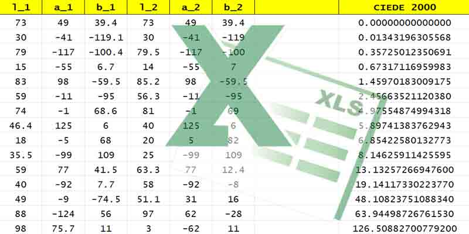

# ΔE2000 — Accurate. Fast. Excel-powered.

ΔE2000 is the current industry standard for quantifying color differences in a way that closely matches human perception.

This canonical **Microsoft Excel** implementation offers a portable and easy way to calculate these differences accurately without programming.

## Overview

This Excel setup enables your software to measure color similarity and difference with scientific rigor.

For reference, two very distinct colors typically have a ΔE2000 value greater than 12.

Lower values indicate greater closeness, making it a **state-of-the-art method** for comparing colors.

## Implementation Details

The Excel spreadsheet is available [here](../../ciede-2000.xls).

Because it relies solely on formulas (no macros or custom functions), it remains highly portable and compatible with many office or scientific environments, including [Google Sheets](https://docs.google.com/spreadsheets).

## Usage in Excel

In the Excel sheet, update the six columns containing the color values (L\*, a\*, b\*) for each color sample, and drag the formula down to compute the ΔE\*00 values across your dataset.

**Note** :
- L\* typically ranges from 0 to 100
- a`\* and b\* usually range from -128 to +127

## Verification

The spreadsheet was successfully tested with the [large-scale generator](https://michel-leonard.github.io/ciede2000-color-matching), and number precision was increased to prevent rounding that might appear erroneous.

## Conclusion

With over 20 years serving developers, this reference color comparison routine **developed in Excel** brings accuracy into your applications.

🌐 [Used in 30+ Languages](../../#implementations)
